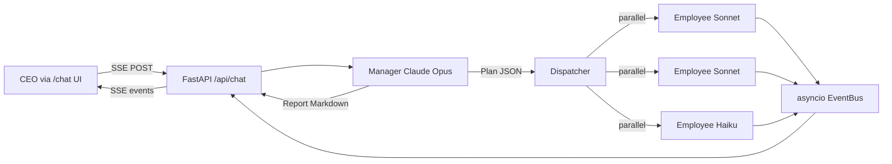

# Command Center

> Multi-agent CEO orchestrator. Send a goal in natural language, watch a Manager LLM decompose it into tasks, dispatch employees in parallel, and synthesize a report — all powered by Claude CLI subprocess (not direct API).

## What it does

The CEO chats with a **Manager** (Claude Opus). The Manager decomposes the goal into typed tasks, dispatches up to N **Employees** (Claude Sonnet/Haiku) running in parallel via subprocess, then synthesizes the results into a Markdown report. Every step streams live to the UI via SSE.

## Architecture



Backend: **FastAPI + sse-starlette + SQLAlchemy async**. Frontend: **Next.js 15 + React 19 + zustand + Tailwind + recharts**. Platform: **Windows-first** (cross-platform compatible).

## Why subprocess CLI instead of Anthropic SDK?

- **Auth via OAuth, not API key** — uses the host's logged-in `claude` CLI session, billing flows through the user's Pro/Max subscription. No `ANTHROPIC_API_KEY` needed.
- **Tool-use sandboxing** — each Employee gets a real `claude` process with the project's `~/.claude/` settings, hooks, and approved tools.
- **Cost passthrough** — overage usage is billed per the user's account terms, no double-charging.

The trade-off: subprocess overhead (~1-2s per call), Windows quirks with reaping, and reliance on CLI's `--output-format stream-json` schema. Worth it for the UX of "your CEO chat costs your monthly Pro subscription, not pay-as-you-go API."

## Quickstart

```bash
# 1. Install backend deps and run
cd command-center-backend
uv sync
uv run uvicorn command_center.main:app --port 8000

# 2. Install frontend deps and run (separate terminal)
cd command-center-frontend
pnpm install
pnpm dev

# 3. Seed demo data (optional, makes UI look "lived-in")
cd command-center-backend
uv run python -m command_center.scripts.seed_demo
```

Open http://localhost:3000/chat.

## Stack

| Layer | Tech |
|---|---|
| Backend | FastAPI, sse-starlette, SQLAlchemy async, structlog, asyncio threading bridge |
| Frontend | Next.js 15 App Router, React 19, zustand, React Query, Tailwind v4, recharts, framer-motion, shadcn/ui |
| LLM | Claude Opus (Manager) + Claude Sonnet/Haiku (Workers) via `claude` CLI |
| DB | SQLite + aiosqlite (single-user; PostgreSQL-ready via SQLAlchemy) |
| Tests | pytest + pytest-asyncio (backend); typecheck via tsc |

## Status & Roadmap

**Done (Frente A — Estabilidade):** subprocess reaping on Windows, EventBus race condition fix, index-based task binding, SSE retry condicional.

**Done (Frente B — Performance & Cost):** skip Manager.report() when plan empty, Sonnet for report (5x cheaper than Opus), GROUP BY for task counts, background polling pause.

**Done (Frente D — Wow Factor):** streaming plan deltas, session cost dashboard with mini-charts, demo seed script.

**Done (Frente C — Eng Polish):** typecheck clean, full test suite green, prompt injection defense, /api/metrics/session endpoint, this README.

**Next:** plan editing before execution, multi-turn conversation memory, real-time agent activity stream.

## Project Structure

```
command-center-backend/
  src/command_center/
    agents/         # Manager, Employee, ClaudeRunner (subprocess wrapper)
    api/            # FastAPI routers: chat, projects, tasks, employees, events, metrics
    db/             # SQLAlchemy models + session
    orchestrator/   # Dispatcher (parallel task execution), TaskQueue
    scripts/        # seed_demo.py
    events.py       # EventBus (asyncio fan-out for SSE)
    config.py       # Pydantic settings
    main.py         # FastAPI app

command-center-frontend/
  src/
    app/            # Next.js App Router pages
    components/     # chat, workers, projects, dashboard, layout
    hooks/          # use-chat, use-projects, use-tasks, use-employees
    lib/            # sse.ts, types.ts, api.ts
    stores/         # chat-store (zustand), active-project
```

## Decisions Log

- **CLI subprocess > Anthropic SDK**: see "Why subprocess CLI" above.
- **Index-based task binding**: backend emits stable plan-index in events; frontend keys by index, not title (titles can collide).
- **EventBus.attach() synchronous**: avoids the race window between subscribe registration and dispatcher publishing.
- **Sonnet default for report**: 5x cheaper than Opus; synthesis doesn't need Opus reasoning.
- **Skip report when plan empty**: greeting "oi" doesn't deserve a $0.15 Opus call to say "no work to do."
- **Auto-retry only before plan_created**: re-running Manager costs $0.15+; user explicitly chooses retry after that.

## License

Personal portfolio project — no formal license attached. Reach out if you want to use code.
